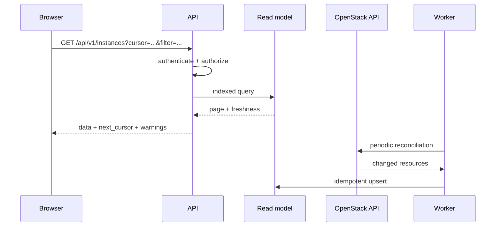
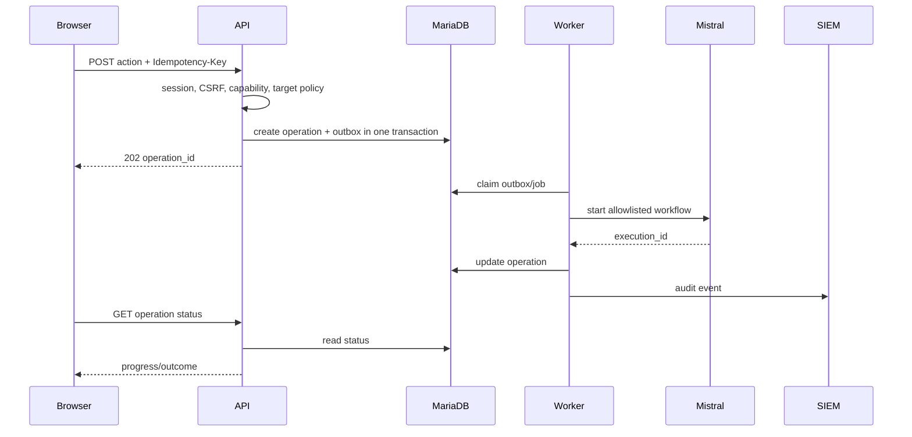

# Целевая архитектура

## Логическая схема

```mermaid
flowchart LR
    U[Браузер оператора] -->|HTTPS, same origin| LB[HAProxy / VIP]
    LB --> FE[Frontend replicas]
    LB --> API[Backend API replicas]

    API --> IDP[Корпоративный IdP]
    API --> KS[Keystone]
    API --> DB[(MariaDB cloud_ui)]
    API --> MQ[(RabbitMQ /cloud-ui)]
    API --> OSAPI[OpenStack service APIs]
    API --> SIEM[SIEM adapter]
    API --> VAULT[Vault (SecMan) adapter]

    WORKER[Background worker replicas] --> DB
    WORKER --> MQ
    WORKER --> OSAPI
    WORKER --> MISTRAL[Mistral]
    MISTRAL --> WATCHER[Watcher]
    MISTRAL --> MASAKARI[Masakari]
    MISTRAL --> HEAT[Heat, опционально]

    EVENTS[Event consumer replicas] --> MQ
    EVENTS --> DB
    EVENTS --> OSAPI

    RECON[Reconciliation jobs] --> OSAPI
    RECON --> DB
```

## Ключевая идея

Backend является BFF: он объединяет неоднородные API OpenStack, нормализует ошибки и поля, применяет прикладную авторизацию и не отдает OpenStack credential в браузер.

Для крупного inventory backend не строит каждую страницу синхронным fan-out по всем сервисам. Он читает индексированную read model из собственной MariaDB. Read model обновляется:

1. первичной полной синхронизацией;
2. периодическим инкрементальным reconciliation;
3. событиями OpenStack, если они доступны и надежно изолированы;
4. точечным refresh после пользовательской операции.

## Runtime-компоненты

### Frontend

Статический SPA. Отвечает за shell, маршрутизацию, таблицы, формы и визуализацию operation status. Получает capabilities от backend. Не содержит секретов и не знает Keystone token.

### API

Обслуживает browser requests, аутентификацию, server-side session, authorization, list/detail endpoints, operation submission и audit queries. Реплики stateless относительно локального диска.

### Worker

Выполняет короткие фоновые задачи портала: reconciliation chunks, enrichment, refresh, отправку событий, cleanup и retry. Длительную бизнес-оркестрацию передает Mistral.

### Event consumer

Получает только специально опубликованные notifications или сообщения собственного exchange. Нормализует события, выполняет idempotent upsert read model и сохраняет cursor/offset.

### Migration job

Одноразовый процесс, выполняющий Alembic upgrade. Не масштабируется и не запускается одновременно несколькими экземплярами без DB lock.

## Интеграционный слой

Каждый сервис реализуется адаптером с единым набором правил:

- typed input/output;
- API microversion;
- timeout;
- bounded concurrency;
- retry только для безопасных временных ошибок;
- mapping внешней ошибки в доменный error;
- metrics;
- correlation ID;
- contract tests;
- mock implementation.

Рекомендуемые модули:

    backend/src/cloud_ui/integrations/keystone/
    backend/src/cloud_ui/integrations/nova/
    backend/src/cloud_ui/integrations/placement/
    backend/src/cloud_ui/integrations/mistral/
    backend/src/cloud_ui/integrations/watcher/
    backend/src/cloud_ui/integrations/masakari/
    backend/src/cloud_ui/integrations/heat/
    backend/src/cloud_ui/integrations/siem/
    backend/src/cloud_ui/integrations/vault/

## Поток чтения inventory



## Поток mutating workflow



## Данные и согласованность

- Источник истины ресурсов — OpenStack.
- Источник истины прикладных групп, ролей и каталога workflow — MariaDB портала.
- Источник истины выполнения длительной операции — Mistral; портал хранит проекцию и correlation.
- Источник истины долговременного централизованного аудита — SIEM.
- Read model допускает eventual consistency, но всегда показывает freshness.
- Изменение группы и создание операции используют транзакцию.
- Надежная публикация после транзакции реализуется transactional outbox.

## Отказоустойчивость

- Потеря API-реплики не теряет сессию или операцию.
- Повторная обработка сообщения безопасна.
- Недоступность OpenStack API не блокирует чтение последней read model, но возвращает warning о stale data.
- Недоступность Mistral не создает дублирующий execution при retry.
- Недоступность SIEM не приводит к silent loss: событие остается в outbox/dead-letter и формируется alert.
- Reconciliation обнаруживает расхождения между OpenStack и read model.

## Что запрещено

- fan-out по всем ВМ при каждом открытии таблицы;
- direct DB query к OpenStack;
- shared admin token;
- хранение токена в frontend;
- выполнение произвольного workflow по строковому имени от клиента;
- использование RabbitMQ RPC queues OpenStack;
- хранение бизнес-состояния в etcd;
- локальная очередь в памяти API;
- автоматическая миграция при старте каждой API-реплики.
