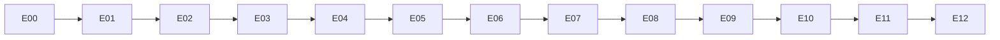

# Этапы разработки для Codex

## Правило выполнения

Один файл этапа — одна ветка/worktree и один активный ExecPlan. Этап можно разбить на несколько сессий Codex, но нельзя выполнять следующий этап до прохождения acceptance текущего.

Каждый этап содержит единицы работы. Оптимальный размер одной единицы — один проверяемый vertical slice и один логический commit. Порядок единиц обязателен, потому что каждая следующая опирается на доказанный результат предыдущей.

## Граф зависимостей

Некоторые исследования E08/E12 можно вести раньше, но production claims и deployment выполняются только в указанном порядке.

## Почему порядок оптимален для Codex

1. E00 убирает неопределенность до генерации кода.
2. E01 создает единые команды, чтобы Codex мог самостоятельно проверять работу.
3. E02 закладывает авторизацию до появления mutating API.
4. E03 отделяет внешние API адаптерами и mocks.
5. E04 дает первый ценный вертикальный срез.
6. E05 добавляет собственную доменную функцию без опасных OpenStack mutations.
7. E06 включает mutating workflow только после RBAC и idempotency.
8. E07 обеспечивает доказуемый аудит до production hardening.
9. E08 оформляет внешние security integrations и gaps.
10. E09 переносит уже проверенное приложение в Kolla.
11. E10 измеряет масштаб и failover на близкой к целевой среде.
12. E11 фиксирует воспроизводимую приемку.
13. E12 не позволяет выдать PoC за полное соответствие ДКБ.

## Формат запроса

Используйте:

> Прочитай `AGENTS.md`, `PLANS.md` и `tasks/<текущий этап>.md`. Проверь входные критерии. Создай ExecPlan. Выполняй единицы работы по порядку, останавливаясь внутри этапа только при безопасной невозможности. Не начинай следующий этап. Запускай проверки после каждой единицы и обновляй evidence/ДКБ.

## Handoff между сессиями

ExecPlan обязан содержать:

- фактически завершенные пункты;
- последний успешный commit;
- команды и результаты;
- текущую ветку;
- незавершенный пункт;
- известные проблемы;
- решения;
- безопасный следующий шаг.

Новая сессия сначала перепроверяет рабочее дерево и тесты, затем продолжает. Она не должна переписывать уже работающую область без finding.

## Уровни результата

- После E04: минимальный inventory PoC.
- После E06: функциональный PoC с группами и workflow.
- После E07: интегрированный security-aware PoC.
- После E10: HA/scale candidate.
- После E12: комплект для решения о production pilot.
