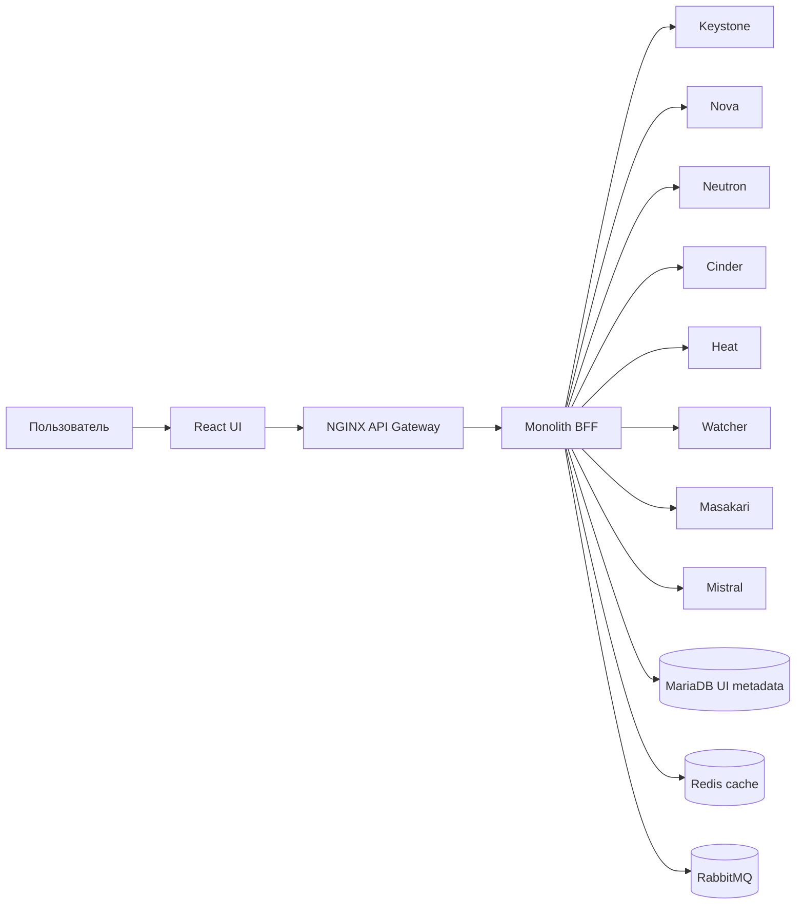
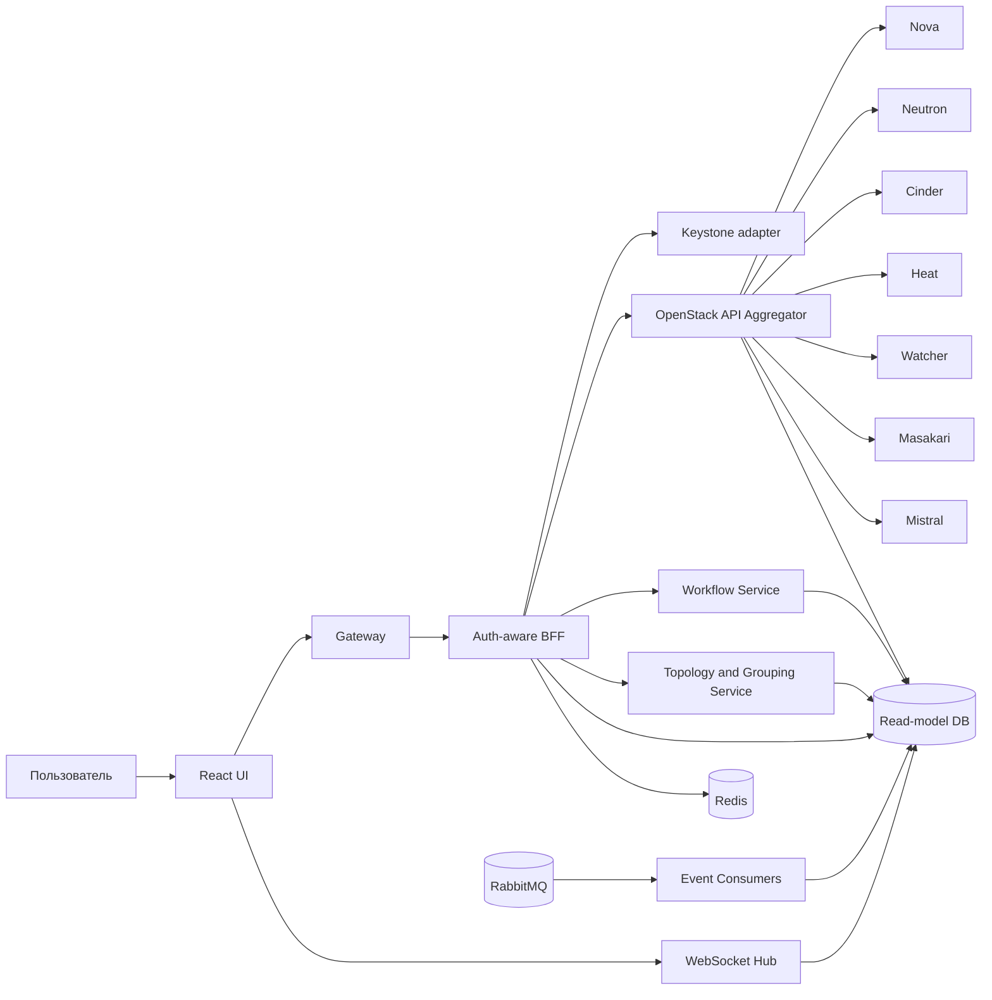
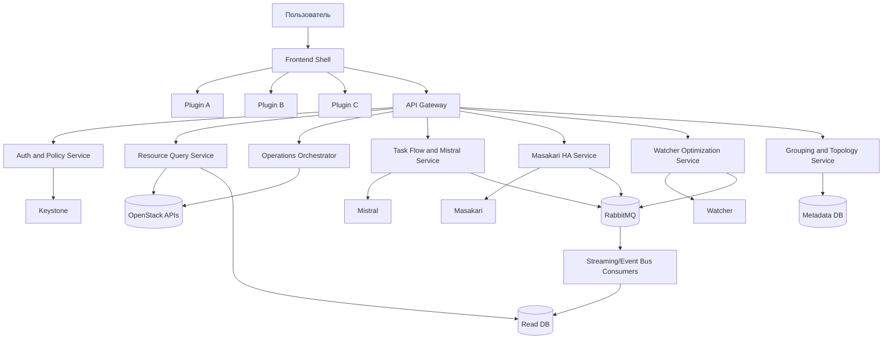

# Архитектурная оценка управления OpenStack Epoxy 2025.1 и выбор между Horizon, Skyline и самописным UI

## Executive summary

Для кластера на OpenStack **Epoxy 2025.1** наиболее прагматичная стратегия выглядит так: **оставить Horizon как основной административный интерфейс в кратко- и среднесрочной перспективе, не делать ставку на Skyline как на единственный стратегический UI, и параллельно проектировать самописный UI под ваши специфические сценарии**. Причина в том, что в Epoxy Horizon поставляется как полноценный и поддерживаемый dashboard серии 25.3.x, а экосистема официальных Horizon-плагинов для **Heat, Watcher, Masakari и Mistral** также присутствует и сопровождается в той же серии. Skyline в Epoxy тоже поддерживается, но его консоль и API-сервер идут как отдельные релизы 6.0.x, а документированное покрытие сервисов и модель расширения значительно уже, чем у Horizon. citeturn40view0turn40view1turn40view2turn43view0turn43view1turn43view2

Если смотреть на задачу не как на “какую веб-морду оставить”, а как на **архитектуру управления облаком**, то у вас фактически три разных класса решений. **Horizon** — лучший выбор для минимизации риска, сохранения официальной совместимости и быстрого доступа к плагинам. **Skyline** — более современный по UX и по общей веб-архитектуре, но не даёт столь же сильной и зрелой модели расширения под ваш набор сервисов и бизнес-процессов. **Самописный UI** становится оправданным тогда, когда нужны одновременно: кастомные роли, группировка ВМ/хостов в прикладные сущности, страницы для очень больших выборок, workflow-панель для Mistral, единый operational cockpit для Masakari/Watcher/Heat и возможность быстро добавлять новые task flow без переписывания core UI. citeturn18search0turn18search5turn41search0turn42view1turn15view0

Ключевой вывод по обновлениям такой. **Horizon обновлять целесообразно**, но синхронно с вашей OpenStack-серией и версиями плагинов: в 2026.1 Gazpacho Horizon остаётся maintained и соответствующие плагины для Heat, Watcher, Masakari и Mistral тоже присутствуют как maintained релизы. **Skyline обновлять стоит только если вы понимаете, какие именно его функции вам нужны**, потому что выигрыш в UX и клиентских возможностях реален, но это не снимает ограничений по покрытию сервисов; кроме того, даже в актуальной документации Skyline Console фигурирует сборка через Node.js 16 Gallium, а в текущем package.json видны React 16, MobX 5 и Ant Design 4.1, то есть стек нельзя назвать “современным без оговорок” в инженерном смысле. citeturn38view0turn39view0turn39view1turn39view2turn39view3turn33view0turn37view0turn37view1turn37view2turn34search0

Практическая рекомендация для вашего кейса: **не заменять Horizon на Skyline “в лоб”**, а идти по двухконтурной модели. Контур первый — **Horizon + официальные плагины** как безопасный административный baseline. Контур второй — **самописный UI с Backend-for-Frontend**, куда постепенно выносятся высоконагруженные страницы, operational dashboards, кастомные task flow и cross-service сценарии. Skyline можно оставить как пилотный или пользовательский modern UI для части compute/network/storage-операций, если он уже внедрён и приносит ценность, но не как единственную платформу управления вашим стеком. citeturn43view0turn43view1turn43view2turn42view1turn17view0turn31view0

## Контекст, версии и неуточнённые параметры

В серии **OpenStack 2025.1 Epoxy** релизная страница показывает, что для панели управления и связанных сервисов доступны и сопровождаются следующие компоненты: **Horizon 25.3.x**, **Skyline APIServer 6.0.0**, **Skyline Console 6.0.1**, а также основные сервисы вашего контура вроде **Watcher 14.1.0**. OpenStack при этом движется шестимесячными релизными циклами, а следующая SLURP-серия **2026.1 Gazpacho** уже содержит **Horizon 25.6.0 / 25.7.3**, **Skyline APIServer 8.0.0**, **Skyline Console 8.0.0**, **Masakari 21.0.0**, **Mistral 22.0.0** и **Watcher 16.0.0**. Это важно, потому что вопрос “обновлять ли UI” в OpenStack почти всегда означает вопрос о **совместимости по серии и экосистеме плагинов**, а не только о версии одной панели. citeturn40view0turn40view1turn40view2turn40view3turn28search2turn38view0

Для Horizon-плагинов в Epoxy есть официально сопровождаемые релизы **heat-dashboard 13.0.0**, **masakari-dashboard 12.0.0**, **mistral-dashboard 20.0.0** и **watcher-dashboard 13.0.0**. Для Gazpacho этот набор тоже сохраняется в maintained-статусе: **heat-dashboard 15.0.0**, **masakari-dashboard 14.0.0**, **mistral-dashboard 22.0.0** и **watcher-dashboard 15.0.0**. С практической точки зрения это означает, что для вашего набора сервисов у Horizon есть **официальная линия совместимости** и понятный путь обновления вместе с релизной серией OpenStack. citeturn43view0turn43view1turn43view2turn40view3turn39view0turn39view1turn39view2turn39view3

Для Skyline официальный контур совместимости тоже есть: в README указывается поддержка **OpenStack Train+**, а в релизных страницах Epoxy и Gazpacho Skyline входит как maintained-проект. Однако это не эквивалентно утверждению “Skyline полноценно покрывает ваш operational stack”. Skyline APIServer действительно знает маппинг для `orchestration: heat` и `instance-ha: masakari`, а в кодовой структуре Skyline Console есть модуль `heat` со Stack-страницами, но в опубликованной структуре консоли **нет отдельных модулей для Masakari, Watcher и Mistral**. То есть совместимость на уровне серии есть, а вот **функциональная полнота UI для ваших сервисов — ограничена**. citeturn19view0turn15view0turn42view1turn42view3

Часть важных для точного решения деталей во входных данных **не уточнена**. В отчёте ниже они отмечаются как неуточнённые и влияют прежде всего на итоговый roadmap и объём работ:

- не указано, какой именно deployment tool используется для облака — Kolla Ansible, OpenStack-Ansible, TripleO, кастомная сборка или иное;
- не указано, установлен ли уже в Horizon полный набор плагинов для Heat, Watcher, Masakari и Mistral;
- не уточнён текущий объём данных в интерфейсе: число проектов, ВМ, гипервизоров, сетей, стеков, аудитов Watcher, workflow execution в Mistral;
- не уточнены профили пользователей: cloud-admin, NOC/SRE, tenant-admin, read-only auditor, service owner и другие;
- не указаны требования к федерации/SSO, хотя Skyline и Keystone это поддерживают;
- не уточнено, как именно используется **etcd** в вашей архитектуре и нужен ли его прямой вывод в UI;
- не указан текущий pain point: медленная отрисовка списков, неудобный UX, отсутствие нужных сервисов, проблемы с RBAC, нехватка дашбордов, невозможность расширения или всё сразу. citeturn17view0turn15view0turn21search0turn20search18

## Сравнение Horizon, Skyline и самописного UI

Ниже — сводное сравнение с акцентом на ваш стек и ваши критерии.

| Критерий | Horizon | Skyline | Самописный UI |
|---|---|---|---|
| Базовая архитектура | Django/WSGI dashboard, обычно за Apache+mod_wsgi; сессии и кеш настраиваются отдельно. citeturn13view2turn13view3 | Nginx + Skyline APIServer + Skyline Console; в установочных примерах Nginx проксирует в skyline через Unix socket или порт 28000. citeturn14search0turn33view0 | Вы проектируете архитектуру под свои сценарии: BFF, агрегаторы данных, read models, event-consumers, streaming. |
| Совместимость с Epoxy 2025.1 | Нативна: Horizon 25.3.x в серии Epoxy. citeturn40view0 | Нативна: Skyline APIServer 6.0.0 и Console 6.0.1 в серии Epoxy. citeturn40view1turn40view2 | Зависит от качества интеграции с API и микроверсиями OpenStack; совместимость — ваша ответственность. |
| Совместимость с более новыми сериями | Поддерживается и в Gazpacho 2026.1, Horizon остаётся maintained. citeturn38view0 | Поддерживается и в Gazpacho 2026.1, Skyline 8.0.0 maintained. citeturn38view0turn29view0turn31view0 | Максимально контролируема, но требует собственной программы регрессионных тестов при каждом апгрейде OpenStack. |
| Плагины и расширяемость | Сильная сторона: официальная модель dashboard/panel/panel group и зрелая экосистема Horizon-плагинов. citeturn1search15turn13view3turn43view0turn43view1turn43view2 | Документированной runtime plugin-модели не видно; расширение идёт через добавление исходников, маршрутов, containers и stores. citeturn42view0turn42view1 | Можно сделать полноценный plugin SDK с фронтовыми и бекендовыми расширениями, но это надо разработать и поддерживать. |
| Производительность | Надёжна для типовых админских задач, но архитектурно сильнее зависит от WSGI-процессов, shared sessions и числа запросов на страницу. Horizon отдельно документирует лимит одновременных AJAX-подключений и особенности сессий. citeturn13view3turn13view2 | OpenStack and Skyline прямо позиционируют его как modern dashboard с higher concurrency, но официальных apples-to-apples бенчмарков против Horizon в найденных первичных источниках нет. citeturn18search0turn18search5turn20search11 | Может быть лучшим вариантом для больших списков и cross-service страниц, если закладывать server-side aggregation, виртуализацию таблиц, кэш и streaming с первого дня. |
| Масштабируемость | Масштабируется горизонтально, но требует одинакового `SECRET_KEY`, корректной сессии и осторожной настройки shared storage/cache для нескольких инстансов. citeturn13view3turn13view0 | Хорошо ложится на Nginx + API backend модель; APIServer имеет конфиги для БД, Prometheus и ролей, а развёртывание обычно уже разделяет nginx и apiserver. citeturn15view0turn33view0 | Масштабируемость можно спроектировать отдельно для read-heavy UI, event ingestion и workflow execution без наследования старых ограничений. |
| Многопоточность и конкурентность | В реальности — модель WSGI workers/processes и браузерных AJAX-запросов; Horizon явно настраивает `ajax_queue_limit`, а распределённая конфигурация требует одинакового секрета на нескольких WSGI workers/инстансах. citeturn13view3 | Архитектура ближе к современному SPA + API server; Skyline docs и README заявляют “higher concurrency performance”, а APIServer запускается через gunicorn. citeturn18search0turn14search0 | Можно строить async BFF, WebSocket/SSE, отдельные consumers и read-model workers под реальные профили нагрузки. |
| Heat | Через официальный heat-dashboard. citeturn43view0 | В Skyline Console есть модуль `heat` и `Stack`, а в APIServer есть сервисный маппинг `orchestration: heat`. citeturn42view1turn42view3turn15view0 | Можно сделать полноценную UI-обвязку вокруг stacks, actions, outputs и шаблонов. |
| Watcher | Через официальный watcher-dashboard. citeturn40view3 | В опубликованной структуре Skyline Console модулей Watcher нет. citeturn42view1 | Можно построить аудит/optimization cockpit поверх Watcher API. |
| Masakari | Через официальный masakari-dashboard. citeturn43view1 | APIServer знает `instance-ha: masakari`, но в структуре Skyline Console отдельного UI-модуля Masakari не видно. citeturn15view0turn42view1 | Можно сделать operational UI для сегментов, хостов, уведомлений и failover-status. |
| Mistral | Через официальный mistral-dashboard. citeturn43view2 | В структуре Skyline Console отдельного UI-модуля Mistral не видно. citeturn42view1 | Можно сделать конструктор/каталог/валидацию/запуск workflow и журнал execution. |

Главный архитектурный плюс Horizon в вашем кейсе — **не “старость”, а зрелость операционной модели и официальная экосистема плагинов**. Horizon поддерживает Python-side конфигурацию dashboard/panel/panel group, а в его настройках и туториалах прямо предусмотрены механизмы добавления модулей, JavaScript-файлов, AngularJS-модулей и панелей. Для набора Heat/Watcher/Masakari/Mistral это критично: у вас уже есть то, что в Skyline пришлось бы либо не использовать, либо достраивать самостоятельно. citeturn13view3turn1search15turn43view0turn43view1turn43view2turn40view3

Главный плюс Skyline — **более современная пользовательская модель**: OpenStack прямо описывает его как modern dashboard, а разработческая документация Skyline Console показывает React-компоненты, routes, stores, unit/E2E tests и модульную организацию кода. Но это одновременно и его ограничение в вашем сценарии: расширение выглядит как **source-level development в рамках самого проекта**, а не как зрелая внешняя плагинная экосистема уровня Horizon. Кроме того, опубликованная структура Skyline Console показывает готовые модули для compute, storage, network, identity и heat stack, но не для Watcher, Mistral и Masakari. citeturn18search5turn41search0turn42view0turn42view1turn42view3

С точки зрения производительности правильнее говорить не “что быстрее вообще”, а **какая архитектура лучше подходит вашему профилю запросов**. Horizon типично проигрывает там, где нужны очень большие агрегированные списки, частые массовые обновления состояния и сквозные страницы, собирающие данные из нескольких сервисов. Это видно хотя бы из того, что Horizon отдельно документирует лимит одновременных AJAX-соединений и нюансы хранения сессий под высокой нагрузкой. Skyline теоретически лучше подходит под конкурентную работу браузера и API backend, но у OpenStack в найденных первичных материалах нет публичной сравнительной таблицы benchmark Horizon vs Skyline, поэтому любые численные обещания были бы спекуляцией. citeturn13view3turn13view2turn18search0turn20search11

## Целесообразность обновления Horizon и Skyline

Если цель — **снизить риск и не потерять покрытие сервисов**, то обновления Horizon выглядят гораздо более рационально, чем “пересадка” на Skyline. В Epoxy Horizon уже совместим с вашими сервисами через maintained-плагины. В Gazpacho вся эта линейка остаётся maintained, а версии плагинов повышаются синхронно с релизной серией OpenStack. Это именно тот тип совместимости, который ценен в эксплуатационной панели: совместимость не только “по логину”, а по operational features. citeturn43view0turn43view1turn43view2turn40view3turn38view0turn39view0turn39view1turn39view2turn39view3

У Skyline польза от обновления есть, но она более узкая. В **2026.1** в release notes Skyline Console указаны, например, поддержка **microversion support в API client**, отображение rescue console, улучшения вокруг instance rebuild и bugfix по pinned CPU host display, а для APIServer в 2026.1 указано, что **поддержка Python 3.8 и 3.9 удалена**. То есть Skyline развивается и получает исправления, но обновление может тянуть за собой требования к runtime и пересборке окружения. Для организаций, где Skyline — не основной operational cockpit, это вполне разумно; для организаций, которые хотят сделать его единственным UI для всего набора сервисов кластера, этого недостаточно. citeturn31view0turn29view0

Отдельный риск Skyline — **технологическое расслоение между “modern dashboard” в позиционировании и фактическим стеком сборки**. В актуальной установочной документации Skyline Console до сих пор указан **Node.js 16 Gallium**, а официальный Node.js уже помечает ветку 16 как **EOL**. В текущем package.json Skyline Console фигурируют **React 16.13.1**, **MobX 5.1.0** и **antd 4.1.3**. Это не значит, что Skyline “плохой”; это значит, что при ставке на него как на долгосрочную платформу придётся учитывать не только OpenStack-совместимость, но и будущую модернизацию самого frontend toolchain. citeturn33view0turn34search0turn34search1turn37view0turn37view1turn37view2

Ниже — практическая матрица по обновлению.

| Сценарий | Выгоды | Риски | Решение |
|---|---|---|---|
| Оставить Horizon в Epoxy и довести плагины до production-ready состояния | Минимальный риск, максимальное покрытие ваших сервисов, понятный путь поддержки. citeturn43view0turn43view1turn43view2turn40view3 | Старый UX, ограниченная гибкость для тяжёлых custom pages. | **Рекомендуется как baseline** |
| Обновить Horizon вместе с OpenStack до следующей серии | Получить свежую maintained-серию и свежие версии плагинов. citeturn38view0turn39view0turn39view1turn39view2turn39view3 | Нужна полная регрессия облака и плагинов на новой серии. | **Хороший путь, если есть план общего апгрейда OpenStack** |
| Ставить Skyline как основной UI поверх текущего Epoxy | Современнее UX, часть compute/network/storage сценариев будет удобнее. citeturn18search0turn20search11 | Не закрывает полноценно Watcher/Mistral/Masakari; расширяемость слабее, чем у Horizon. citeturn42view1turn15view0 | **Не рекомендуется как единственная панель** |
| Обновить Skyline до более новой серии как sidecar UI | Новые клиентские возможности, bugfixes, microversion support. citeturn31view0turn29view0 | Требования к Python и устаревший frontend toolchain остаются фактором. citeturn29view0turn33view0turn34search0 | **Допустимо в роли дополнительного UI** |
| Запускать программу самописного UI параллельно с Horizon | Лучшее попадание в ваши реальные процессы. | Существенная стоимость и обязательная инженерная дисциплина. | **Стратегически оправдано** |

Для совместимости модулей итог простой. **Heat** можно закрыть во всех трёх подходах: в Horizon — официальным плагином, в Skyline — существующим heat/stack модулем, в custom UI — прямой интеграцией с Heat API. **Watcher, Masakari и Mistral** в Horizon имеют официальный путь через плагины, а в Skyline — не выглядят как first-class UI modules по опубликованной структуре консоли. Для вашего operational профиля это решающий аргумент в пользу Horizon как опорного решения на время построения нового UI. citeturn43view0turn43view1turn43view2turn40view3turn42view1turn42view3turn15view0

## Архитектурные варианты самописного UI

Самописный UI имеет смысл проектировать не как “ещё одну панель”, а как **операционный слой поверх OpenStack APIs и событий**, с отдельной read-heavy моделью отображения и с plugin SDK для доменных расширений. Для вашего кластера основные требования выглядят так: изолировать UI от прямой fan-out нагрузки на OpenStack APIs, научить интерфейс работать с большим числом ВМ и хостов, позволить добавлять прикладные группы и task flow, и не ломать встроенную модель multi-tenant/RBAC Keystone. Это приводит к трём разумным вариантам архитектуры. citeturn21search0turn21search8turn24view3turn25view1turn26view2turn26view3turn45view0turn45view1turn45view2

### Минимальный вариант

Этот вариант подходит, если цель — быстро вынести из Horizon самые нагруженные или самые неудобные страницы, не строя сложную платформу. Подходит для MVP или для “операционного кабинета” первой очереди.

Его сильная сторона — простота, быстрый старт и низкая стоимость владения на первом этапе. Его слабая сторона — ограниченный запас по масштабированию: при росте числа экранов и event-driven сценариев BFF начинает превращаться в “большой шар грязи”. Я бы использовал этот вариант только в том случае, если вы хотите в течение 2–3 месяцев вынести в новый UI ограниченный набор задач: крупные списки ВМ, группировка по бизнес-сервисам, Heat stacks, базовый Masakari cockpit и запуск Mistral workflows. Это уже даст ценность без тотальной замены существующей панели.

### Масштабируемый вариант

Это основной вариант, который я считаю **наиболее сбалансированным** для вашего кейса. Он отделяет online-операции от read-heavy страниц и вводит слой агрегированных read models.

Именно здесь решаются ваши сложные требования. Для больших списков и composite pages пользовательский интерфейс читает не “сырые” десятки OpenStack API подряд, а **агрегированные read models**. Для workflow и task flow появляется отдельный сервис, который умеет валидировать Mistral DSL, запускать execution, следить за execution tree и прокидывать статус в UI. Для группировки ВМ/хостов появляется доменный сервис, где живут ваши прикладные сущности: группы, сервисные контуры, environment labels, blast radius, owner team и так далее. Для real-time используется WebSocket hub, а события тянутся из RabbitMQ и из периодических poller/job consumers.

### Микросервисный вариант

Это вариант для тех случаев, когда UI становится **продуктом платформенного уровня**, а не просто фронтендом к OpenStack. Он нужен, только если у вас действительно много команд, много независимых доменных модулей и отдельная roadmap на годы.

Этот вариант лучше всего закрывает требование “гибко добавлять custom task flow в UI” и “поддержка плагинов”, потому что плагинами становятся уже не просто вкладки, а самостоятельные bounded contexts. Но этот же вариант самый дорогой и самый рискованный: он требует развитого platform engineering, зрелой дисциплины API-versioning, хорошего observability, контракта на plugin SDK и отдельной команды владения платформой UI.

С инженерной точки зрения я рекомендую **масштабируемый вариант** как целевой, а минимальный — как стартовый этап. Микросервисный вариант имеет смысл только если вы заранее понимаете, что у вас будет несколько независимых продуктовых доменов внутри одной облачной панели.

## Рекомендуемый стек, точки интеграции и шаблоны ролей

### Рекомендуемый стек

Ниже — стек, который лучше всего сочетается с вашим окружением и целевой архитектурой.

| Слой | Рекомендация | Почему это подходит именно здесь |
|---|---|---|
| Frontend | **React + TypeScript**, state/query layer с акцентом на server-state, виртуализированные таблицы для больших списков | Нужны большие data grids, сложные фильтры, lazy loading, plugin host и долгоживущий modern UI. Skyline сам показывает, что React-модель удобна для такого класса интерфейсов. citeturn18search5turn41search0 |
| Plugin model | **Frontend shell + manifest-based plugins**, без runtime-remote until phase 2; сначала package-based plugins, потом при необходимости module federation | Снижает сложность на старте и позволяет вынести Heat/Masakari/Watcher/Mistral в отдельные расширения |
| Backend | **FastAPI-based BFF** | FastAPI прямо поддерживает `async`/`await` и WebSockets, что хорошо ложится на read-heavy pages и real-time status updates. citeturn44search0turn44search1turn44search8 |
| API gateway | **NGINX или Envoy** | Нужны TLS termination, rate limiting, headers, websocket pass-through, path routing |
| Auth | **Keystone v3 токены как основной механизм**, опционально федерация/OIDC для SSO | Keystone остаётся source of truth по identity и scope; Skyline/Kolla отдельно документируют поддержку SSO через OpenID. citeturn21search8turn21search0turn17view0turn20search18 |
| Service auth | **Application credentials для машинных интеграций** | Не надо хранить пользовательские пароли; application credentials позволяют делегировать подмножество project roles. citeturn21search1 |
| Cache | **Redis** | Быстрые кэши списков, session/state cache, anti-stampede, pub/sub для UI streaming |
| DB | **MariaDB для UI metadata и управляемых сущностей**, потому что она уже есть; при росте read-heavy страниц — отдельная read-model БД | Минимизирует операционную стоимость на старте и использует существующую экспертизу команды |
| Message bus | **RabbitMQ reuse** | Уже есть в кластере; подходит для event consumers, fan-out обновлений статусов и интеграции со служебными событиями |
| Real-time | **WebSockets для operator dashboards**, fallback на polling/SSE для менее критичных экранов | FastAPI поддерживает WebSockets; для больших таблиц важно комбинировать streaming только для изменившихся сущностей. citeturn44search0turn44search4 |
| Workflow engine | **Mistral как backend для custom task flow**, поверх него — собственный workflow catalog/launcher service | Mistral уже есть у вас и предоставляет API для workflows, validate и executions. citeturn26view2turn26view1turn24view0 |
| Observability | **Prometheus + OpenTelemetry** | Prometheus рекомендует instrument everything; OpenTelemetry Python покрывает traces/metrics/logs и авто-/ручную инструментализацию. citeturn44search2turn44search3turn44search10turn44search18 |
| CI/CD | **GitLab CI или GitHub Actions**, плюс обязательный preview environment и e2e pipeline | Для UI-платформы критичны автоматические интеграционные тесты, snapshot/regression и быстрый rollout |
| Testing | **Unit + API contract + e2e + load tests** | Skyline сам использует unit/E2E tooling; custom UI должен идти ещё дальше и покрывать OpenStack contract drift. citeturn37view3turn20search3 |

Если нужен короткий и жёсткий выбор, то я бы рекомендовал такой **целевая комбинация**: **React/TypeScript frontend + FastAPI BFF + Redis + MariaDB + RabbitMQ + Keystone v3 + WebSockets + Prometheus/OpenTelemetry**. Она хорошо сочетается с уже существующими компонентами и не привязывает вас к архитектурным ограничениям Horizon или Skyline.

### Точки интеграции с существующими компонентами

Для такого UI центральная идея — интегрироваться **не с базами данных OpenStack напрямую**, а с официальными API и event-stream слоями. MariaDB, RabbitMQ и, опционально, etcd используются как инфраструктурные зависимости, но не как альтернатива сервисным API.

| Компонент | Основные точки интеграции | Для чего в UI | Источник |
|---|---|---|---|
| Keystone | Identity API v3: auth/tokens, projects, groups, roles, system role assignments, application credentials | login, role mapping, tenant context, service credentials | citeturn21search8turn21search1turn21search0 |
| Heat | `POST /v1/{tenant_id}/stacks`, `GET /v1/{tenant_id}/stacks/.../outputs`, `POST /v1/{tenant_id}/stacks/{stack_name}/{stack_id}/actions` | создание/обновление стеков, outputs, stack actions | citeturn25view1 |
| Mistral | `GET/POST /v2/workflows`, `POST /v2/workflows/validate`, `GET/POST /v2/executions` | каталог workflow, валидация DSL, запуск task flow, execution log | citeturn26view2turn26view1turn26view3 |
| Watcher | `POST /v1/audit_templates`, `POST /v1/audits` | шаблоны оптимизации, запуск аудитов и наблюдение за ними | citeturn24view3 |
| Masakari | `GET /segments`, `GET/POST /segments/{segment_id}/hosts`, `GET/POST /notifications` | сегменты отказоустойчивости, хосты в сегментах, статус/история failover notifications | citeturn45view0turn45view1turn45view2turn45view3 |
| RabbitMQ | событие-ориентированные consumers, UI status fan-out, async job updates | real-time обновления и event-driven read models | citeturn24view0turn23search1turn24view1 |
| MariaDB | UI metadata, plugin registry, grouping, policy overrides, saved views, task presets | хранение управляемых сущностей самого UI | citeturn14search0turn14search2 |
| etcd | только read-only adapter при реальной необходимости | показывать cluster-coordination status, но не использовать как бизнесовую БД UI | неуточнено во входных данных |
| Horizon | SSO/redirect coexistence, постепенный deep-link coexistence | совместная эксплуатация в период миграции | citeturn13view2turn20search14 |
| Skyline | sidecar-панель для ограниченного набора сценариев, если уже используется | постепенная замена/параллельный доступ | citeturn17view0turn31view0 |

Отдельно стоит подчеркнуть роль **RabbitMQ** и **Mistral**. В Mistral есть API Server, Engine, Task Executors, Scheduler и Notifier; это даёт естественное место для интеграции custom task flow в UI. У Mistral также есть event engine конфигурация через oslo.messaging. У Masakari сами уведомления о сбоях представлены в API как объект `notification` и отдельно документированы статусы `new`, `running`, `finished`. Это делает связку “RabbitMQ consumers + Mistral workflow launcher + Masakari status UI” очень естественной для операционного интерфейса. citeturn24view0turn23search1turn45view1

### Шаблоны ролей и правил доступа

Базироваться стоит на стандартных ролях Keystone: **admin**, **member**, **reader**, которые с Rocky создаются как default roles и могут назначаться на нужных scope. Для нового UI их не надо ломать; наоборот, лучше построить поверх них **тонкий слой прикладочных ролей UI**, который конвертирует бизнес-полномочия в набор разрешений интерфейса и разрешённых API-операций. citeturn21search0turn21search17

Предлагаемый шаблон ролей для вашего UI:

| Роль UI | База в Keystone | Scope | Типичный доступ |
|---|---|---|---|
| `cloud_admin` | `admin` / `system_admin` | system | полный доступ ко всем модулям, policy overrides, plugin management |
| `platform_operator` | `reader` + custom UI claim | system | просмотр кластера, ВМ, хостов, статусов, запуск безопасных operational actions |
| `tenant_admin` | `member` / project admin mapping | project | управление ресурсами проекта, Heat stacks, запуск разрешённых workflow |
| `tenant_reader` | `reader` | project | только просмотр ресурсов проекта и статусов |
| `workflow_designer` | `member` + Mistral-specific grant | project or domain | создавать/валидировать workflow, запускать execution, но без platform-admin действий |
| `ha_operator` | `reader` + Masakari-specific grant | system | сегменты, хосты, уведомления, failover state view |
| `optimizer_operator` | `reader` + Watcher-specific grant | system | audit templates, audits, результаты оптимизации |
| `auditor` | `reader` | system/project | только просмотр, экспорт и audit trail |

Для правил доступа я рекомендую двойной слой:

1. **Источник истины по identity и scope — Keystone**.  
2. **UI policy engine** проверяет, что конкретный экран, кнопка, bulk-action и task flow допустимы для пользователя.  
3. **OpenStack service policy** остаётся окончательным enforcement layer на стороне каждого сервиса.  

Skyline APIServer уже показывает типичный паттерн такого подхода через `policy_file_path`, `system_admin_roles`, `system_reader_roles` и `enforce_new_defaults`. Аналогичную модель стоит использовать и в custom UI: не переписывать авторизацию OpenStack, а аккуратно надстраивать над ней UX-политику и маршрутизацию. citeturn15view0turn21search14turn21search18

## Масштабирование, безопасность, мониторинг и тестирование производительности

По масштабированию ключевая мысль проста: **страницы с большим объёмом данных нельзя строить как “UI вызывает десятки OpenStack endpoint-ов напрямую на каждый экран”**. Именно поэтому в custom UI нужен read layer. Для списков ВМ, гипервизоров, хостов сегментов и execution history надо использовать **server-side pagination, server-side filtering, сортировку на backend, column projection и виртуализацию на frontend**. Для Horizon это особенно актуально: он сам документирует лимит одновременных AJAX-запросов и частое опрашивание переходных состояний. Это хороший индикатор того, что при больших объёмах данных архитектура панели становится важнее “красивого интерфейса”. citeturn13view3

По многопоточности и concurrency для custom UI я рекомендую такую схему. Online BFF строится как async API, а тяжёлые и долгие операции выносятся в **job orchestration**: Mistral execution, background sync, event consumers, rebuild read models. WebSocket hub должен слать в браузер не полные таблицы, а **дельты по изменившимся сущностям**. Cache нужен не только для ускорения ответов, но и для защиты OpenStack APIs от шторма одинаковых запросов. Для масштабируемого варианта это обычно означает минимум три независимых класса воркеров: API workers, consumer workers, scheduler/sync workers.

По безопасности я рекомендую закладывать сразу следующие механизмы: TLS на всём внешнем трафике; короткоживущие UI session tokens; никакого сохранения пользовательских паролей; service-to-service доступ только через application credentials или service users; строгие audit logs на все destructive operations; CSRF/XSS/CSP/secure headers; отдельные permissions для bulk-операций и task flow; и обязательный **tenant boundary verification** на каждом backend endpoint. Для SSO оптимально опираться на Keystone federation/OIDC, а не плодить собственный identity layer. Skyline/Kolla прямо документируют OpenID SSO для Skyline, а Keystone документирует федерацию и современную role/scope модель. citeturn17view0turn20search18turn21search0turn21search8turn21search1

По observability стратегия должна быть не “добавим метрики потом”, а “инструментируем всё сразу”. Prometheus в своих best practices прямо рекомендует instrument everything, а OpenTelemetry Python даёт единый путь к traces, metrics и logs, включая auto- и manual instrumentation. Для вашего UI-контура я бы считал обязательными такие метрики и трейсы: latency каждого backend endpoint, fan-out к OpenStack APIs, cache hit ratio, размер очередей consumers, lag event processing, время обновления read models, число активных WebSocket connections, error rate по типам сервисов и распределение latency по ключевым экранам. citeturn44search2turn44search9turn44search3turn44search10turn44search18

По нагрузочному тестированию рекомендую проверять не “среднюю” панель, а конкретные проблемные пользовательские пути. Минимальный набор сценариев такой: массовый логин и переключение контекста проекта; список ВМ на 1 000 / 10 000 / 50 000 элементов; список гипервизоров и хостов сегментов; массовые обновления статусов через WebSocket; создание/обновление Heat stack; валидация и запуск Mistral workflow; запуск Watcher audit; чтение и фильтрация Masakari notifications. К каждому сценарию нужны SLO: p95 latency, p99 latency, error rate, time-to-first-meaningful-paint, data freshness lag. На мой взгляд, именно такие тесты должны быть gating factor для rollout, а не только unit/integration suite.

## План поэтапного внедрения, риски, трудозатраты и roadmap

Наиболее безопасный путь внедрения — **не миграция большой кнопкой, а поэтапное сосуществование**. Horizon остаётся production baseline, Skyline — опциональный дополнительный UI, а custom UI появляется как новый тонкий слой для конкретных задач. Это позволяет не ставить целый облачный контур в зависимость от молодого продукта и одновременно постепенно переносить пользователей на те экраны, где новый подход действительно выигрывает.

Я бы рекомендовал такой roadmap.

| Этап | Содержание | Оценка |
|---|---|---|
| Подготовка | инвентаризация текущих pain points, матрица пользователей, включение/проверка Horizon-плагинов, описание целевых сценариев | 2–4 недели |
| Стабилизация baseline | привести Horizon к “опорному состоянию”: Heat/Watcher/Masakari/Mistral, роли, ссылки, логи, мониторинг панели | 2–6 недель |
| MVP custom UI | login через Keystone, каталог проектов, крупные списки ВМ/хостов, группировки, saved views, basic audit logs | 8–12 недель |
| Workflow and operations | Heat page, Mistral workflow catalog/validate/run, Masakari notifications/segments, базовые страницы Watcher | 10–16 недель |
| Scale-out layer | read models, consumers из RabbitMQ, WebSocket streaming, observability, performance tests, cache warm-up | 6–10 недель |
| Production rollout | pilot group, canary, rollback plan, migration guide, coexistence with Horizon, user training | 4–8 недель |

Если говорить о трудозатратах более конкретно, то для **минимального варианта** реальный MVP обычно потребует **4–6 человеко-месяцев на первую полезную версию** и **команду в 4–6 FTE** на 3–4 месяца. Для **масштабируемого варианта**, который я рекомендую, разумно считать **6–9 месяцев** до production-grade системы при команде примерно **6–8 FTE**: frontend, backend, platform/devops, QA/performance, плюс архитектурное владение и эксперт по OpenStack API/RBAC. Для полноценной **микросервисной платформы UI** оценка уходит скорее в **9–15 месяцев** и требует отдельной продуктовой/платформенной ответственности.

Основные риски проекта такие. Первый — попытка “выкинуть Horizon сразу”, потеряв official plugin coverage. Второй — недооценка глубины RBAC и tenant boundary. Третий — прямые чтения из множества OpenStack APIs без read-model слоя, что быстро убивает отзывчивость. Четвёртый — превращение Mistral в “универсальный костыль” без каталога, валидации, шаблонов и governance. Пятый — попытка тащить в UI прямую зависимость от etcd или внутренних БД сервисов. Поэтому архитектурно правильный курс выглядит так: **Horizon как страховка, custom UI как инвестиция, Skyline только там, где он уже реально удобен и не создаёт функционального долга**. citeturn43view0turn43view1turn43view2turn40view3turn24view0turn26view2turn26view1turn45view1

В финальном виде моя рекомендация для вашего кейса звучит так:

1. **Краткосрочно**: закрепить Horizon как основной административный UI и включить/проверить официальные плагины для Heat, Watcher, Masakari и Mistral.  
2. **Среднесрочно**: строить **самописный масштабируемый UI** с React + FastAPI BFF + Keystone + MariaDB + Redis + RabbitMQ + WebSockets + Prometheus/OpenTelemetry.  
3. **Организационно**: не считать Skyline стратегической заменой Horizon для вашего текущего operational stack; использовать его только как дополнительную современную панель там, где он уже покрывает нужные сценарии и не подменяет отсутствующие функции. citeturn38view0turn43view0turn43view1turn43view2turn42view1turn31view0